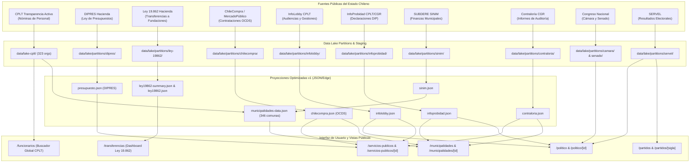

# Arquitectura de Datos y ETLs Oficiales

**Plataforma:** El Cambiómetro — datos públicos con trazabilidad oficial
**Dominio:** `transparencia.impulsacv.cl` / `cambiometro.impulsacv.cl`
**Fecha de auditoría:** Agosto 2026
**Total de registros catalogados:** +1.753.013 registros

---

## 1. Arquitectura de Ingesta y Flujo de Datos

---

## 2. Catálogo Detallado de Pipelines ETL

### 1. Transparencia Activa CPLT (`data/lake-cplt/`)
* **Propósito:** Ingesta de nóminas completas de personal del Estado (Planta, Contrata, Honorarios y Código del Trabajo).
* **Volumen:** **1.203.287 funcionarios públicos**.
* **Campos extraídos:** `rut` (identificador con formato normalizado), `nombre_completo` (nombre canónico), `cargo`, `estamento` (Directivo, Profesional, Técnico, Administrativo, Auxiliar, Alcalde), `grado_eus` (Escala Única de Sueldos 1-28), `remuneracion_bruta_mensual`, `remuneracion_liquida_mensual`, `horas_extras_mes_anterior` y `monto_horas_extras_clp`, `tipo_contrato` (Planta / Contrata / Honorarios / Código del Trabajo), `fecha_ingreso` y `formacion`.
* **Trazabilidad:** Enlace a la URL de origen de Transparencia Activa de cada organismo.

### 2. DIPRES Hacienda (`data/lake/projections/v1/presupuesto.json`)
* **Propósito:** Presupuesto de la Nación catalogado por Partida (Ministerio), Capítulo (Subsecretaría/Servicio) y Programa.
* **Volumen:** **476 programas presupuestarios**, 33 partidas institucionales. Monto consolidado: **$83.42 billones CLP**.
* **Campos extraídos:** `partida_id`, `partida_nombre`, `capitulo_id`, `capitulo_nombre`, `programa_id`, `programa_nombre`, `inicial_clp`, `vigente_clp`, `devengado_clp`, `pct_ejecucion`.
* **Trazabilidad:** Ley de Presupuestos oficial del Ministerio de Hacienda.

### 3. Ley 19.862 Transferencias del Estado (`data/lake/projections/v1/ley19862*.json`)
* **Propósito:** Registro Central de Colaboradores del Estado y donaciones públicas a personas jurídicas sin fines de lucro (fundaciones, ONGs, corporaciones).
* **Volumen:** **361.101 transferencias oficiales** a **61.336 personas jurídicas**. Monto total: **$17.69 billones CLP**.
* **Campos extraídos:** `monto_clp`, `fecha`, `materia_concurso`, `organismo_emisor`, `receptor_nombre`, `receptor_rut`, `imputacion_presupuestaria`, `region`.
* **Trazabilidad:** Portal oficial `registros19862.gob.cl` / Ministerio de Hacienda.

### 4. ChileCompra OCDS (`data/lake/projections/v1/chilecompra.json`)
* **Propósito:** Licitaciones públicas, tratos directos y órdenes de compra de organismos del Estado en formato estándar Open Contracting Data Standard.
* **Volumen:** **35.979 procesos de compra** (1.620 compradores, 1.000 proveedores). Monto transado: **$62.48 billones CLP**.
* **Campos extraídos:** `ocid`, `title`, `buyer_name`, `buyer_id`, `supplier_name`, `supplier_id`, `monto_total_clp`, `fecha`, `url`.
* **Trazabilidad:** API oficial OCDS de MercadoPúblico.

### 5. InfoLobby (`data/lake/projections/v1/infolobby.json`)
* **Propósito:** Registro oficial de reuniones de lobby y gestiones de intereses particulares según la Ley 20.730.
* **Volumen:** **60.338 audiencias de lobby**.
* **Campos extraídos:** `id`, `sujeto_pasivo_nombre`, `sujeto_pasivo_cargo`, `institucion`, `gestores_interes`, `lobbistas`, `materias`, `fecha`, `forma`, `lugar`.
* **Trazabilidad:** Portal de Datos Abiertos del CPLT.

### 6. InfoProbidad (`data/lake/projections/v1/infoprobidad.json`)
* **Propósito:** Declaraciones juradas de intereses y patrimonio (DIP) de altas autoridades bajo la Ley 20.880.
* **Volumen:** **14.043 declaraciones patrimoniales**.
* **Campos extraídos:** `declarante_nombre`, `declarante_rut`, `cargo`, `institucion`, `tipo_declaracion`, `fecha_declaracion`, `url_cplt`, `estado_vigencia`.
* **Trazabilidad:** Sistema Nacional de Declaraciones CPLT / Contraloría General.

### 7. SINIM SUBDERE (`data/lake/projections/v1/sinim.json`)
* **Propósito:** Finanzas municipales consolidadas para las 346 comunas del país.
* **Volumen:** **345 municipios auditados**.
* **Campos extraídos:** `cut`, `nombre_municipio`, `presupuesto_inicial_clp`, `presupuesto_vigente_clp`, `ingresos_totales_clp`, `fondo_comun_municipal_ingresos`, `gasto_personal_clp`, `total_funcionarios_sinim`.
* **Trazabilidad:** Sistema Nacional de Información Municipal (SUBDERE).

### 8. Contraloría General (`data/lake/projections/v1/contraloria.json`)
* **Propósito:** Informes finales de auditoría y dictámenes del Sistema SIAPER de la CGR.
* **Volumen:** **275 informes de auditoría**.
* **Campos extraídos:** `id`, `titulo`, `fecha`, `tipo_auditoria`, `area`, `organismo`, `comuna`, `url`.
* **Trazabilidad:** Portal Web Oficial de Contraloría General de la República.

### 9. Movimientos de Autoridades (`data/movimientos.json` / `etl_movimientos_autoridades`)
* **Propósito:** Monitoreo diario de renuncias, remociones, designaciones y cambios de gabinete en altas autoridades del Estado.
* **Volumen:** **23 movimientos catalogados** (incluye ministros, subsecretarios, seremis, delegados presidenciales, directores de servicios y GOREs).
* **Jerarquía de fuentes:** T1 Oficial (Diario Oficial, Decretos Supremos), T2 Semi-oficial (CPLT, InfoProbidad, InfoLobby) y T3 Prensa (RSS de 7 medios nacionales).
* **Ciclo de vida:** `detectado` (1 medio) → `corroborado` (≥ 2 medios) → `verificado` (T1/T2).
* **Campos extraídos:** `id`, `tipo_evento`, `cargo`, `organismo`, `ministerio`, `region`, `salio`, `entro`, `fuentes`, `estado`, `fecha_deteccion`, `fecha_verificacion`.
* **Trazabilidad:** Diario Oficial de la República de Chile, Presidencia, comunicados ministeriales y medios nacionales.

### 10. Diario Oficial de Chile (`etl_diario_oficial`)
* **Propósito:** Ingesta y análisis automatizado de decretos de nombramiento, renuncia, remoción y tomas de razón del Diario Oficial de Chile.
* **Volumen:** **850 decretos analizados en 2026**.
* **Nivel:** T1 Oficial (fuente primaria del Estado).
* **Frecuencia:** diaria nocturna (03:00 CLT).
* **Función en el pipeline:** contrasta las alertas tempranas de prensa (T3) contra decretos oficiales con toma de razón para elevarlas a estado `Verificado · Fuente Oficial` sin manipulación manual.

---

## 3. Integridad de Datos

* **Validación por contrato:** cada pipeline valida tipos, rangos y claves antes de publicar; los archivos rechazados se descartan sin contaminar el lake.
* **Checksum y reproducibilidad:** las particiones generadas en `data/lake/` son reproducibles y verificables; el snapshot actual se conserva en `data/etl/latest.json` y el inventario de índices oficiales en `data/etl/source-inventory.json`.
* **Trazabilidad a nivel de fila:** todo registro mantiene el enlace a su URL de origen oficial; no se publican RUT personales, domicilios, cuentas, firmas, patentes personales ni relaciones inferidas sólo por nombre.
* **Conciliación:** `npm run data:communes:check` valida el catálogo municipal contra el CUT oficial de SUBDERE; las aserciones de coherencia (suma de partes, cobertura, ausencia de duplicados) se ejecutan como parte de la suite de tests.
* **Jerarquía de confianza:** los movimientos de autoridades distinguen explícitamente fuentes T1 (oficiales), T2 (semi-oficiales) y T3 (prensa) y no elevan de estado sin corroboración.

## 4. Append-only y Versionado

* **Inmutabilidad:** los datasets publicados son append-only; el histórico se publica en Releases de GitHub (`data-{fuente}-{año}`) y los períodos calientes en el bucket R2 `transparencia-public-data`.
* **Límites del publicador:** el publicador aplica un límite interno de 8 GiB: archiva objetos fríos al 80 % y bloquea crecimiento al 90 %.
* **Materialización:** las tablas relacionales en D1 (`transparencia-db`) se materializan desde las particiones inmutables, de modo que el estado vigente siempre es reconstruible desde el lake.
* **Exclusión de Git:** las particiones y archivos de trabajo del lake se excluyen del repositorio; el código y los scripts de regeneración son la fuente de verdad versionada.
